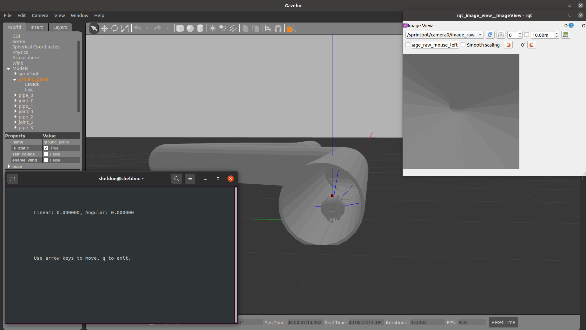

  1. in the pipeworld_ws, run $ colcon build $
  2. $ source ./install/setup.bash $
  3. run \$ ros2 launch pipeworld sprintbot_world.launch.py \$
  4. for the keyboard control, run \$ ros2 run key_teleop key_teleop \$
  5. for the camera topic, run \$ ros2 run rqt_image_view rqt_image_view \$
  
  if you run it correctly, you might see it as show in the figure.
  
  
